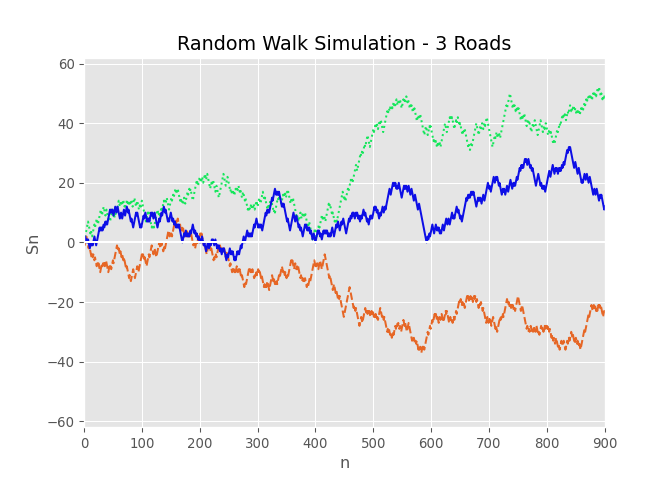

<!-- -->

``` python
import numpy as np
import matplotlib.pyplot as plt

# Definindo a semente de pseudo-aleatorização
np.random.seed(314)

# Sequência de v.a's de Bernoulli transformadas em -1 e +1
seq1 = [i if i==1 else -1 for i in np.random.randint(2, size=900)]
seq2 = [i if i==1 else -1 for i in np.random.randint(2, size=900)]
seq3 = [i if i==1 else -1 for i in np.random.randint(2, size=900)]

# Inserindo S0 = 0 para cada uma das 3 sequências
seq1.insert(0,0)
seq2.insert(0,0)
seq3.insert(0,0)

# Soma acumulativa para gerar a sequência {Sn}
road1 = np.cumsum(seq1)
road2 = np.cumsum(seq2)
road3 = np.cumsum(seq3)

# Lista dos estados de tempo (de 0 a 900)
n_seq = list(range(901))

# Criação e exibição do gráfico
plt.style.use("ggplot")
fig,ax = plt.subplots()

ax.plot(n_seq,road1, c='#E66625', linestyle='--')
ax.plot(n_seq,road2, c='#15E65B', linestyle=':')
ax.plot(n_seq,road3, c='#0D0EE6', linestyle="-")
ax.axhline(y=0, color='white')
plt.xlim([0,900])
lim_y = max(-min(min(road1),min(road2),min(road3)),max(max(road1),max(road2),max(road3)))+10
plt.ylim([-lim_y,+lim_y])

ax.set_xlabel('n')
ax.set_ylabel('Sn')
ax.set_title("Random Walk Simulation - 3 Roads")

plt.show()
```

``` r
head(mtcars)
```

    ##                    mpg cyl disp  hp drat    wt  qsec vs am gear carb
    ## Mazda RX4         21.0   6  160 110 3.90 2.620 16.46  0  1    4    4
    ## Mazda RX4 Wag     21.0   6  160 110 3.90 2.875 17.02  0  1    4    4
    ## Datsun 710        22.8   4  108  93 3.85 2.320 18.61  1  1    4    1
    ## Hornet 4 Drive    21.4   6  258 110 3.08 3.215 19.44  1  0    3    1
    ## Hornet Sportabout 18.7   8  360 175 3.15 3.440 17.02  0  0    3    2
    ## Valiant           18.1   6  225 105 2.76 3.460 20.22  1  0    3    1
